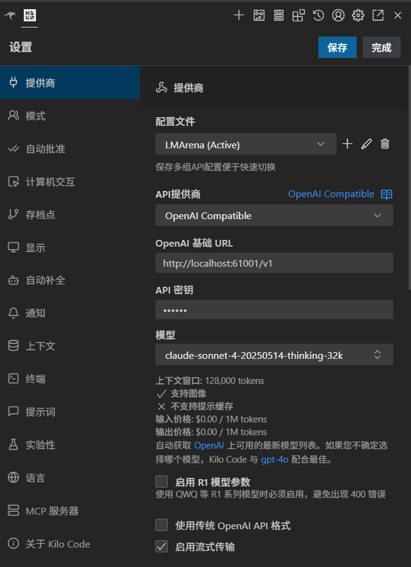

[English](README_EN.md) | [中文](README.md)

# 🤖 LMArena-API

> **免费使用 Claude、GPT-4、Gemini 等顶级 AI 模型的桌面工具**

LMArena-API 是一款桌面应用，让你无需付费订阅，就能在各种 AI 客户端中使用 Claude、GPT-4、Gemini 等多种顶级大语言模型，通过逆向技术将LMArena.ai平台的所有模型转为兼容OpenAI格式，实现API调用。

---

## 软件截图

<table style="width:100%; border-collapse:collapse;">
  <tr>
    <td style="text-align:center; padding:6px;">
      
    </td>
    <td style="text-align:center; padding:6px;">
      
    </td>
  </tr>
  <tr>
    <td style="text-align:center; padding:6px;">
      
    </td>
    <td style="text-align:center; padding:6px;">
      
    </td>
  </tr>
</table>

## ✨ 特性一览

- ✅ 跨平台支持（Windows / macOS）
- ✅ 绿色版，解压即用，无需安装
- ✅ 兼容 OpenAI API 格式
- ✅ 内置网页客户端，无需外部依赖
- ✅ 支持多客户端负载均衡
- ✅ 现代化暗色主题界面
- ✅ 实时日志查看

---

## 🎯 这款工具适合谁？

> 💡 **更多好玩工具前往该地址：** [https://ai.tostring.site/](https://ai.tostring.site/)

| 👤 用户类型 | 使用场景 | 推荐客户端 |
|------------|---------|-----------|
| **日常用户** | 与 AI 对话、写作辅助、问答 | Cherry Studio |
| **程序员** | AI 辅助编程、代码审查、Debug | Roo Code (VS Code 插件) |
| **翻译用户** | 网页翻译、文档翻译、字幕翻译 | 沉浸式翻译 |
| **开发者** | 在自己的程序中调用 AI 接口 | 直接调用 API |

---

## 🚀 30 秒快速开始

### 第一步：下载安装

从 [GitHub Releases](https://github.com/jtostrings/LMarenaBridge/releases) 下载latest版本：

| 操作系统 | 下载文件 | 说明 |
|---------|---------|------|
| **Windows** | `LMArena-API-win.7z` | 解压即用，无需安装 |
| **macOS-inter芯片** | `LMArena-API-mac-x64` | 拖入应用程序文件夹 |
| **macOS-M芯片** | LMArena-API-mac-arm64 | 拖入应用程序文件夹 |

### 第二步：启动并配置

> ⚠️ **重要提醒：** 在开始配置之前，请先开启梯子（VPN）并打开 TUN 模式，否则可能无法正常访问 LMArena 服务。

1. **启动应用** → 运行 LMArena-API

2. **创建客户端** → 进入「网页客户端」页面 → 点击「新建客户端」

3. **网站条款验证** → 在弹出的页面中发送任意一条消息

4. **启动服务** → 回到「服务控制」页面 → 点击「启动服务」

5. **测试服务** → 进入「API 测试」页面，选择模型后点击「测试」，正确响应后代表服务启动成功

   

✅ 完成！现在你的本地 API 服务已在 `http://127.0.0.1:61001` 运行

### 第三步：配置你的 AI 客户端

在任意支持 OpenAI API 的客户端中填写：

| 配置项 | 值 |
|-------|-----|
| **API 地址** | `http://127.0.0.1:61001` 或 `http://127.0.0.1:61001/v1` |
| **API 密钥** | `123456`（可在应用「配置管理」中修改） |
| **模型** | 从应用「模型管理」中选择任意模型 |

---

## 📱 主流客户端配置教程

### Cherry Studio（AI 对话客户端）

Cherry Studio 是一款跨平台的 AI 对话客户端，界面美观，功能丰富。

**配置步骤：**

1. 打开 Cherry Studio → 设置 → 添加新的 API 提供商
2. 选择「OpenAI Compatible」（OpenAI 兼容）
3. 填写配置信息：
   - **API 地址：** `http://127.0.0.1:61001`
   - **API 密钥：** `123456`

4. 保存并测试连接


---

### Kilo Code（VS Code AI 编程助手）

Kilo Code 是一个强大的 VS Code AI 编程插件，类似于 Cursor AI。

**配置步骤：**

1. 在 VS Code 扩展市场安装 **Kilo  Code**
2. 打开插件设置 → 选择「Custom/自定义提供商」
3. 填写配置：
   - **Base URL：** `http://127.0.0.1:61001/v1`
   - **API Key：** `123456`
   - **Model：** 选择你想用的模型



**现在你可以：**
- 💬 与 AI 对话讨论代码问题
- ✍️ 让 AI 帮你编写代码
- 🔍 让 AI 审查和优化代码
- 🐛 协助调试和修复 Bug

---

### 沉浸式翻译（网页/文档翻译）

[沉浸式翻译](https://immersivetranslate.com/) 是一款优秀的网页翻译扩展，配合顶级 AI 模型，翻译质量远超传统翻译。

**配置步骤：**

1. 安装沉浸式翻译浏览器扩展
2. 打开扩展设置 → 翻译服务 → 选择「OpenAI」
3. 切换到「自定义 API」
4. 填写配置：
   - **API URL：** `http://127.0.0.1:61001/v1/chat/completions`
   - **API Key：** `123456`
   - **模型：** 选择你想用的 AI 模型


**现在你可以：**
- 🌐 用顶级 AI 模型翻译网页
- 📄 翻译 PDF 文档
- 📺 翻译视频字幕

###  文生图


**提示**: 如果文生图功能报错,建议使用 Google 账号登录 LMArena 后重试。

---

## 💻 开发者 API 调用指南

如果你是开发者，想在自己的程序中调用 API，请参考以下示例。

### API 端点

| 端点 | 方法 | 说明 |
|-----|------|------|
| `/v1/chat/completions` | POST | OpenAI 兼容的聊天接口 |
| `/v1/models` | GET | 获取可用模型列表 |

### Python 代码示例

#### 流式响应（实时输出）

适合需要实时显示 AI 回复的场景：

<details>
<summary><b>📋 点击展开代码</b></summary>

```python
import requests
import json

# API 配置
url = "http://127.0.0.1:61001/v1/chat/completions"
API_KEY = "123456"

headers = {
    "Content-Type": "application/json",
    "Authorization": f"Bearer {API_KEY}"
}

payload = {
    "model": "claude-sonnet-4-20250514",
    "messages": [
        {"role": "user", "content": "你好，请介绍一下你自己"}
    ],
    "stream": True
}

def stream_chat():
    response = requests.post(url, headers=headers, json=payload, stream=True, timeout=180)
    response.raise_for_status()
    
    for line in response.iter_lines():
        if line:
            line_str = line.decode('utf-8')
            if line_str.startswith('data:'):
                json_str = line_str[len('data: '):].strip()
                if json_str == '[DONE]':
                    break
                try:
                    data = json.loads(json_str)
                    content = data.get('choices', [{}])[0].get('delta', {}).get('content', '')
                    if content:
                        print(content, end='', flush=True)
                except json.JSONDecodeError:
                    continue

if __name__ == "__main__":
    stream_chat()
```

</details>

#### 非流式响应（等待完整回复）

适合不需要实时显示的场景：

<details>
<summary><b>📋 点击展开代码</b></summary>

```python
import requests

# API 配置
url = "http://127.0.0.1:61001/v1/chat/completions"
API_KEY = "123456"

headers = {
    "Content-Type": "application/json",
    "Authorization": f"Bearer {API_KEY}"
}

payload = {
    "model": "claude-sonnet-4-20250514",
    "messages": [
        {"role": "user", "content": "你好，请介绍一下你自己"}
    ]
}

def chat():
    response = requests.post(url, headers=headers, json=payload, timeout=180)
    response.raise_for_status()
    
    data = response.json()
    content = data['choices'][0]['message']['content']
    print(f"AI 回复：{content}")
    return data

if __name__ == "__main__":
    chat()
```

</details>

---

## ⚙️ 应用功能说明

### 服务控制

- 一键启动/停止 API 服务
- 实时显示服务运行状态和时长

### 网页客户端管理

- **新建客户端：** 创建独立的浏览器会话
- **预览/隐藏：** 实时查看客户端页面状态
- **多客户端支持：** 创建多个客户端可提高并发处理能力

> **📖 详细配置指南：** 如需手动配置浏览器端油猴脚本或开启并发模式，请参考 [Websocket-client.md](Websocket-client.md) 文档。

### 配置管理

- API 密钥设置（默认 `123456`）
- 端口配置（默认 `61001`）
- 全局会话模式：开启后，所有请求将共享同一个会话上下文（推荐开启）

### 模型管理

- 查看所有可用 AI 模型
- 按名称、提供商搜索过滤
- 一键更新模型列表

---

## ❓ 常见问题

<details>
<summary><b>授权码如何获取？</b></summary>
请通过以下方式联系作者，

微信: tostring1 (如果扫码失败, 请直接搜索微信号)
备用 QQ: 854569279
Telegram: https://t.me/jtostring

> 💡 **更多好玩工具前往该地址：** [https://ai.tostring.site/](https://ai.tostring.site/)


</details>

### 安装与启动

<details>
<summary><b>macOS 提示「无法打开」或「已损坏」？</b></summary>

这是 macOS 的安全保护机制。解决方法：

**方法一（推荐）：**
1. 点击「取消」关闭提示
2. 打开「系统设置」→「隐私与安全性」
3. 滚动到底部，点击「仍要打开」

**方法二：** 右键点击应用 → 选择「打开」

</details>

<details>
<summary><b>端口 61001 被占用？</b></summary>

- 应用会自动尝试终止占用端口的进程
- 或在「配置管理」中修改端口号

</details>

### 使用问题

<details>
<summary><b>模型列表为空？</b></summary>

1. 确保至少创建了一个网页客户端
2. 确保服务已启动（在「服务控制」页面点击「启动服务」）
3. 点击「模型管理」中的「更新模型列表」按钮

</details>

<details>
<summary><b>API 请求没有响应？</b></summary>

1. 检查服务是否正在运行
2. 查看应用底部日志面板的错误信息
3. 确认模型名称是否正确

</details>

<details>
<summary><b>如何提高并发处理能力？</b></summary>

在「网页客户端」页面创建多个客户端可以提高并发处理能力。系统会将新的会话请求分配给不同的网页客户端，实现并行处理。需要注意的是，每个会话的内容依然保存在对应的网页客户端中，不会跨客户端共享。

**高级配置：** 如需开启并发模式并配置多个浏览器客户端，请参考 [Websocket-client.md](Websocket-client.md) 文档中的「高级功能 - 并发模式」部分。

</details>

<details>
<summary><b>遇到 429 错误（请求次数过多）？</b></summary>

429 错误是因为 LMArena 平台对每个会话有请求频率限制。解决方法：

**方法一（推荐）：** 在 AI 客户端中新建一个会话，继续提问。系统会自动将新会话分配给不同的客户端，绕过频率限制。

**方法二：** 等待 10-20 分钟，限制会自动解除。

**方法三：** 删除对应的网页客户端后再创建一个新的客户端，绕过频率限制。详细步骤请参考 [Websocket-client.md](Websocket-client.md) 文档。

</details>

<details>
<summary><b>遇到 403 错误如何解决？</b></summary>
403 错误通常是因为触发了人机验证。解决方法：

**如果使用网页客户端模式：**
- **方法一（推荐）：** 进入「网页客户端」页面，点击客户端的「预览」按钮，在打开的页面中手动完成人机验证。
- **方法二：** 在「网页客户端」页面删除当前客户端，切换到新的 VPN 节点后，新建一个客户端并完成验证（发送任意消息），即可恢复使用。

**如果使用 Websocket 客户端模式：**
- 在浏览器中手动完成人机验证，刷新页面即可恢复使用。
- 如果频繁触发验证，建议检查使用频率，或考虑切换到 Websocket 客户端模式（Websocket 客户端能有效降低人机校验触发率）。

**长期解决方案：**
如果经常遇到 403 错误，建议切换到 **Websocket 客户端模式**，它能有效降低人机校验的触发率。详细配置请参考 [Websocket-client.md](Websocket-client.md) 文档。

</details>

<details>
<summary><b>如何升级软件？</b></summary>

**Windows 用户升级步骤：**

1. **备份认证凭据：** 将软件目录中的 `.auth` 与 `.client_id` 文件复制至桌面临时目录，随后删除现有软件包及其关联目录
2. **获取最新发行版：** 从 [GitHub Releases](https://github.com/jtostrings/LMarenaBridge/releases) 下载最新版本
3. **恢复认证配置：** 将桌面备份的 `.auth` 与 `.client_id` 文件迁移至解压后的根目录，确保持久化身份验证与客户端标识
4. **重启应用进程**

> **注意：** macOS 用户无需移动认证文件，必要情况下只需更新 LMArena.js 脚本即可。

**WebSocket 客户端更新脚本（可选）：**

如果你使用的是 WebSocket 客户端模式，还需要更新油猴脚本：

1. 在油猴脚本管理器中移除旧版 LMArena.js
2. 从 [script/LMArena.js](https://github.com/jtostrings/LMarenaBridge/blob/master/script/LMArena.js) 获取最新脚本，添加到脚本管理页面
3. 完全重启浏览器实例以应用脚本更新

</details>

## 📚 相关文档

- [Websocket-client.md](Websocket-client.md) - 浏览器客户端配置指南（油猴脚本安装、并发模式配置等）
- [UsageGuide.md](UsageGuide.md) - 正确使用指南（最佳实践、常见问题应对、省钱黑科技等）

## 🙏 致谢

- [LMArena](https://lmarena.ai) - AI 模型评估平台
