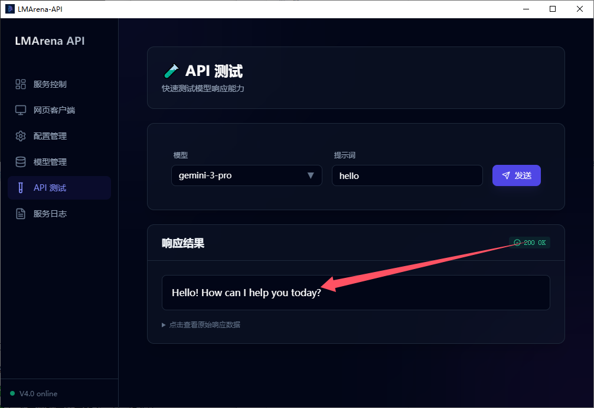

[中文](README.md) | [English](README_EN.md)

# 🤖 LMArena-API

> **Desktop tool for free access to top AI models like Claude, GPT-4, Gemini, etc.**

LMArena-API is a desktop application that allows you to use various top-tier large language models such as Claude, GPT-4, and Gemini in any AI client without a paid subscription. It uses reverse engineering to convert all models from the LMArena.ai platform into an OpenAI-compatible format, enabling API calls.

---

## Screenshots

<table style="width:100%; border-collapse:collapse;">
  <tr>
    <td style="text-align:center; padding:6px;">
      
    </td>
    <td style="text-align:center; padding:6px;">
      
    </td>
  </tr>
  <tr>
    <td style="text-align:center; padding:6px;">
      
    </td>
    <td style="text-align:center; padding:6px;">
      
    </td>
  </tr>
</table>

## ✨ Features

- ✅ Cross-platform support (Windows / macOS)
- ✅ Portable version, unzip and run, no installation required
- ✅ Compatible with OpenAI API format
- ✅ Built-in web client, no external dependencies
- ✅ Supports multi-client load balancing
- ✅ Modern dark theme interface
- ✅ Real-time log viewing

---

## 🎯 Who is this tool for?

| 👤 User Type | Usage Scenario | Recommended Client |
|------------|---------|-----------|
| **Daily User** | Chat with AI, writing assistance, Q&A | Cherry Studio |
| **Programmer** | AI-assisted coding, code review, Debug | Roo Code (VS Code Extension) |
| **Translator** | Web page translation, document translation, subtitle translation | Immersive Translate |
| **Developer** | Call AI interfaces in your own program | Direct API Call |

---

## 🚀 30-Second Quick Start

### Step 1: Download and Install

Download the latest version from [GitHub Releases](https://github.com/jtostrings/LMarenaBridge/releases):

| OS | File | Note |
|---------|---------|------|
| **Windows** | `LMArena-API-win.7z` | Unzip and run, no installation required |
| **macOS-Intel** | `LMArena-API-mac-x64` | Drag into Applications folder |
| **macOS-Apple Silicon** | `LMArena-API-mac-arm64` | Drag into Applications folder |

### Step 2: Start and Configure

> ⚠️ **Important:** Before starting configuration, please enable your VPN and turn on TUN mode, otherwise you may not be able to access LMArena services normally.

1. **Start App** → Run LMArena-API

2. **Create Client** → Go to "Web Client" page → Click "New Client"

3. **Verify Terms** → Send any message in the popped-up page

4. **Start Service** → Go back to "Service Control" page → Click "Start Service"

5. **Test Service** → Go to "API Test" page, select a model and click "Test". A correct response indicates the service started successfully.

   

✅ Done! Your local API service is now running at `http://127.0.0.1:61001`

### Step 3: Configure Your AI Client

Fill in the following in any OpenAI API compatible client:

| Config Item | Value |
|-------|-----|
| **API URL** | `http://127.0.0.1:61001` or `http://127.0.0.1:61001/v1` |
| **API Key** | `123456` (Can be modified in "Config Management") |
| **Model** | Select any model from "Model Management" |

---

## 📱 Mainstream Client Configuration Guide

### Cherry Studio (AI Chat Client)

Cherry Studio is a cross-platform AI chat client with a beautiful interface and rich features.

**Configuration Steps:**

1. Open Cherry Studio → Settings → Add new API provider
2. Select "OpenAI Compatible"
3. Fill in configuration info:
   - **API URL:** `http://127.0.0.1:61001`
   - **API Key:** `123456`

4. Save and test connection


---

### Roo Code (VS Code AI Coding Assistant)

Roo Code is a powerful VS Code AI programming extension, similar to Cursor AI.

**Configuration Steps:**

1. Install **Roo Code** in VS Code Extension Marketplace
2. Open extension settings → Select "Custom/Custom Provider"
3. Fill in configuration:
   - **Base URL:** `http://127.0.0.1:61001/v1`
   - **API Key:** `123456`
   - **Model:** Select the model you want to use


**Now you can:**
- 💬 Chat with AI to discuss code issues
- ✍️ Let AI help you write code
- 🔍 Let AI review and optimize code
- 🐛 Assist in debugging and fixing bugs

---

### Immersive Translate (Web/Document Translation)

[Immersive Translate](https://immersivetranslate.com/) is an excellent web translation extension that, combined with top AI models, provides translation quality far superior to traditional translation.

**Configuration Steps:**

1. Install Immersive Translate browser extension
2. Open extension settings → Translation Service → Select "OpenAI"
3. Switch to "Custom API"
4. Fill in configuration:
   - **API URL:** `http://127.0.0.1:61001/v1/chat/completions`
   - **API Key:** `123456`
   - **Model:** Select the AI model you want to use


**Now you can:**
- 🌐 Translate web pages with top AI models
- 📄 Translate PDF documents
- 📺 Translate video subtitles

### Text to Image


**Tip**: If the Text-to-Image function reports an error, it is recommended to log in to LMArena with a Google account and try again.

---

## 💻 Developer API Guide

If you are a developer and want to call the API in your own program, please refer to the following examples.

### API Endpoints

| Endpoint | Method | Description |
|-----|------|------|
| `/v1/chat/completions` | POST | OpenAI compatible chat interface |
| `/v1/models` | GET | Get list of available models |

### Python Code Examples

#### Streaming Response (Real-time Output)

Suitable for scenarios requiring real-time display of AI responses:

<details>
<summary><b>📋 Click to expand code</b></summary>

```python
import requests
import json

# API Config
url = "http://127.0.0.1:61001/v1/chat/completions"
API_KEY = "123456"

headers = {
    "Content-Type": "application/json",
    "Authorization": f"Bearer {API_KEY}"
}

payload = {
    "model": "claude-sonnet-4-20250514",
    "messages": [
        {"role": "user", "content": "Hello, please introduce yourself"}
    ],
    "stream": True
}

def stream_chat():
    response = requests.post(url, headers=headers, json=payload, stream=True, timeout=180)
    response.raise_for_status()
    
    for line in response.iter_lines():
        if line:
            line_str = line.decode('utf-8')
            if line_str.startswith('data:'):
                json_str = line_str[len('data: '):].strip()
                if json_str == '[DONE]':
                    break
                try:
                    data = json.loads(json_str)
                    content = data.get('choices', [{}])[0].get('delta', {}).get('content', '')
                    if content:
                        print(content, end='', flush=True)
                except json.JSONDecodeError:
                    continue

if __name__ == "__main__":
    stream_chat()
```

</details>

#### Non-Streaming Response (Wait for Complete Reply)

Suitable for scenarios not requiring real-time display:

<details>
<summary><b>📋 Click to expand code</b></summary>

```python
import requests

# API Config
url = "http://127.0.0.1:61001/v1/chat/completions"
API_KEY = "123456"

headers = {
    "Content-Type": "application/json",
    "Authorization": f"Bearer {API_KEY}"
}

payload = {
    "model": "claude-sonnet-4-20250514",
    "messages": [
        {"role": "user", "content": "Hello, please introduce yourself"}
    ]
}

def chat():
    response = requests.post(url, headers=headers, json=payload, timeout=180)
    response.raise_for_status()
    
    data = response.json()
    content = data['choices'][0]['message']['content']
    print(f"AI Reply: {content}")
    return data

if __name__ == "__main__":
    chat()
```

</details>

---

## ⚙️ App Function Description

### Service Control

- One-click start/stop API service
- Real-time display of service running status and duration

### Web Client Management

- **New Client:** Create independent browser sessions
- **Preview/Hide:** Real-time view of client page status
- **Multi-client Support:** Creating multiple clients can improve concurrency

> **📖 Detailed Config Guide:** For manual configuration of browser-side Tampermonkey scripts or enabling concurrency mode, please refer to [Websocket-client.md](Websocket-client.md) documentation.

### Config Management

- API Key setting (Default `123456`)
- Port configuration (Default `61001`)
- Global Session Mode: When enabled, all requests will share the same session context (Recommended enabled)

### Model Management

- View all available AI models
- Search and filter by name, provider
- One-click update model list

---

## ❓ FAQ

<details>
<summary><b>How to get authorization code?</b></summary>
Please contact the author via the following methods:

WeChat: tostring1 (If scanning fails, please search for the WeChat ID directly)
Backup QQ: 854569279
Telegram: https://t.me/jtostring


</details>

### Installation & Startup

<details>
<summary><b>macOS says "Cannot be opened" or "Damaged"?</b></summary>

This is macOS's security protection mechanism. Solution:

**Method 1 (Recommended):**
1. Click "Cancel" to close the prompt
2. Open "System Settings" → "Privacy & Security"
3. Scroll to the bottom, click "Open Anyway"

**Method 2:** Right-click the app → Select "Open"

</details>

<details>
<summary><b>Port 61001 is occupied?</b></summary>

- The app will automatically try to terminate the process occupying the port
- Or modify the port number in "Config Management"

</details>

### Usage Issues

<details>
<summary><b>Model list is empty?</b></summary>

1. Ensure at least one web client is created
2. Ensure the service is started (Click "Start Service" in "Service Control" page)
3. Click "Update Model List" button in "Model Management"

</details>

<details>
<summary><b>No response from API request?</b></summary>

1. Check if the service is running
2. Check error information in the log panel at the bottom of the app
3. Confirm if the model name is correct

</details>

<details>
<summary><b>How to improve concurrency?</b></summary>

Creating multiple clients in the "Web Client" page can improve concurrency. The system will distribute new session requests to different web clients for parallel processing. Note that the content of each session is still saved in the corresponding web client and will not be shared across clients.

**Advanced Config:** To enable concurrency mode and configure multiple browser clients, please refer to the "Advanced Features - Concurrency Mode" section in [Websocket-client.md](Websocket-client.md).

</details>

<details>
<summary><b>Encounter 429 Error (Too Many Requests)?</b></summary>

429 error is because the LMArena platform has request frequency limits for each session. Solution:

**Method 1 (Recommended):** Create a new session in the AI client and continue asking. The system will automatically assign the new session to a different client, bypassing the frequency limit.

**Method 2:** Wait for 10-20 minutes, the limit will be lifted automatically.

**Method 3:** Delete the corresponding web client and create a new one to bypass the frequency limit. For detailed steps, please refer to [Websocket-client.md](Websocket-client.md).

</details>

<details>
<summary><b>How to solve 403 Error?</b></summary>
403 error is usually because human verification is triggered. Solution:

**If using Web Client Mode:**
- **Method 1 (Recommended):** Go to "Web Client" page, click the "Preview" button of the client, and manually complete the human verification in the opened page.
- **Method 2:** Delete the current client in "Web Client" page, switch to a new VPN node, then create a new client and complete verification (send any message) to restore usage.

**If using Websocket Client Mode:**
- Manually complete human verification in the browser, refresh the page to restore usage.
- If verification is triggered frequently, it is recommended to check usage frequency, or consider switching to Websocket Client Mode (Websocket Client can effectively reduce human verification trigger rate).

**Long-term Solution:**
If you frequently encounter 403 errors, it is recommended to switch to **Websocket Client Mode**, which can effectively reduce the trigger rate of human verification. For detailed configuration, please refer to [Websocket-client.md](Websocket-client.md).

</details>

<details>
<summary><b>How to upgrade software?</b></summary>

**Windows User Upgrade Steps:**

1. **Backup Auth Credentials:** Copy `.auth` and `.client_id` files from the software directory to a temporary desktop directory, then delete the existing software package and its associated directories
2. **Get Latest Release:** Download the latest version from [GitHub Releases](https://github.com/jtostrings/LMarenaBridge/releases)
3. **Restore Auth Config:** Move the `.auth` and `.client_id` files backed up on the desktop to the root directory after unzipping, ensuring persistent authentication and client identity
4. **Restart App Process**

> **Note:** macOS users do not need to move auth files, just update the LMArena.js script if necessary.

**WebSocket Client Update Script (Optional):**

If you are using WebSocket Client Mode, you also need to update the Tampermonkey script:

1. Remove the old LMArena.js in Tampermonkey script manager
2. Get the latest script from [script/LMArena.js](https://github.com/jtostrings/LMarenaBridge/blob/master/script/LMArena.js), add to script management page
3. Completely restart the browser instance to apply script update

</details>

## 📚 Related Docs

- [Websocket-client.md](Websocket-client.md) - Browser Client Configuration Guide (Tampermonkey script installation, concurrency mode configuration, etc.)
- [UsageGuide.md](UsageGuide.md) - Usage Guide (Best practices, common issues, money-saving tips, etc.)

## 🙏 Acknowledgements

- [LMArena](https://lmarena.ai) - AI Model Evaluation Platform
