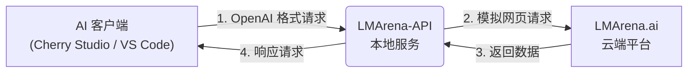

# 📘 LMArena-API 正确使用指南

> **核心认知**：LMArena-API 是一个基于**逆向工程**的工具。它本质上是模拟用户在浏览器中的操作，将 LMArena 平台的免费对话功能转换为 API 接口。
>
> **这意味着**：所有请求最终都会经过 LMArena 的网页接口。如果你的使用频率或并发量远超正常人类在网页聊天的速度，平台必然会进行限制（429 限流或 403 验证）。**本工具适合个人日常使用，不适合高并发的工业级生产环境。**

---

## 🛠️ 工作原理

为了让你更好地理解为什么会出现各种限制，请看下面的数据流转图：

**关键点**：**LMArena-API** 本质上就像一个替你在浏览器里打字的人。如果你让它打字太快（高频请求），或者同时开十几个窗口狂发消息（高并发），LMArena 平台就会察觉到“这不是正常人”，从而弹出验证码或暂时封锁。

---

## 🚦 常见问题与应对

在使用过程中，你可能会遇到以下两个最常见的错误代码，这是逆向工具的**必然现象**，请理性看待：

### 1. `429 Too Many Requests` (请求过快)
*   **原因**：触发了 LMArena 平台的频率限制。虽然模型免费，但平台对单个会话/IP 的请求速度有限制。
*   **对策**：
    *   **切换模型**：尝试切换到同类型的其他模型后再试（例如从 `gpt-4-turbo` 切换到 `gpt-4o`）。
    *   **新建会话**：在你的 AI 客户端中开启新对话（这通常会分配一个新的 Session ID）。
    *   **多客户端轮询**：开启多个浏览器标签页（详见下文“多客户端并发”），让请求分摊到不同窗口。
    *   **休息一下**：暂停 10-20 分钟。

### 2. `403 Forbidden` (人机校验)
*   **原因**：请求特征被识别为机器人，触发了 Cloudflare 或平台的强力验证。
*   **对策**：
    *   **手动验证**：你需要回到浏览器（或应用内的预览窗口），手动点击验证码或刷新页面，直到能正常发送消息。
    *   **切换模式**：强烈建议使用 **油猴脚本模式**，它基于真实浏览器，通过率远高于内置的网页客户端。

> 🔗 **更多解决方案**：点击查看 [README - 常见问题](README.md#❓-常见问题)

---

## ⚙️ 关键功能详解

为了获得最佳体验，你需要理解以下 4 个核心概念：

### 1. 网页客户端 vs 油猴脚本
*   **网页客户端 (内置)**：
    *   应用自带的模拟浏览器环境。
    *   **缺点**：指纹特征较固定，容易被平台识别，**403 触发率较高**。
    *   **适用**：偶尔使用，不想配置浏览器的懒人用户。
*   **油猴脚本 (推荐)**：
    *   运行在你日常使用的真实浏览器（Chrome/Edge）中。
    *   **优点**：拥有真实的浏览器指纹和 Cookie，**极大地降低人机校验概率**，更稳定。
    *   **适用**：高频使用、编程辅助等主力场景。

### 2. 全局会话模式 (Global Session)
*   **默认状态**：开启。
*   **作用**：将所有 AI 客户端（无论你在 Cherry Studio 里开了多少个窗口）的请求，都强制指向同一个 LMArena 会话。
*   **优点**：上下文连续，节省资源。
*   **缺点**：如果你同时在聊两个不同的话题，上下文会混在一起。
*   **如何关闭**：在配置页面关闭此选项并重启服务。关闭后，AI 客户端的每个新对话都会对应 LMArena 的一个新会话。

### 3. 多客户端并发
*   **原理**：LMArena-API 支持负载均衡。你可以同时打开 3 个 LMArena 网页（挂载油猴脚本）。
*   **效果**：当你发送大量请求时，API 会自动轮询这 3 个网页，让 A 网页处理请求 1，B 网页处理请求 2。
*   **收益**：显著减少 429 错误的发生，提高整体吞吐量。

---

## 🏆 最佳实践场景

结合 LMArena-API 的特性，以下是它最能发光发热的场景：

### 场景一：日常对话与文案写作
*   **推荐搭配**：**Cherry Studio** + **LMArena-API**
*   **优势**：Cherry Studio 界面美观，支持多模型切换。你可以免费使用 Claude 4.5 Sonnet 或 GPT-4o 来润色文章、翻译文档，完全没有额度焦虑。

### 场景二：编程辅助 (省钱黑科技)
*   **推荐搭配**：**VS Code** + **Roo Code (插件)** + **Cursor**
*   **策略**：**"LMArena 负责思考，Cursor 负责干活"**
    1.  **复杂分析**：当遇到复杂的 Bug 或需要设计系统架构时，使用 **Roo Code** 调用 LMArena-API (Claude 4.5)。让它进行深度的代码分析、逻辑推演，给出完整的解决方案。因为这是免费的，你可以让它反复思考、重写。
    2.  **代码落地**：拿到解决方案后，再使用 **Cursor** 的 Tab 补全功能或 Composer 小范围修改代码。
    *   **收益**：这种组合方式可以极大地节省 Cursor 昂贵的 Fast Request 额度，将好钢用在刀刃上。

### 场景三：文生图
*   **功能**：支持调用 nano-banana-pro 等绘图模型。
*   **注意**：绘图请求较慢，且容易触发风控，建议在 Google 账号登录状态下使用。
